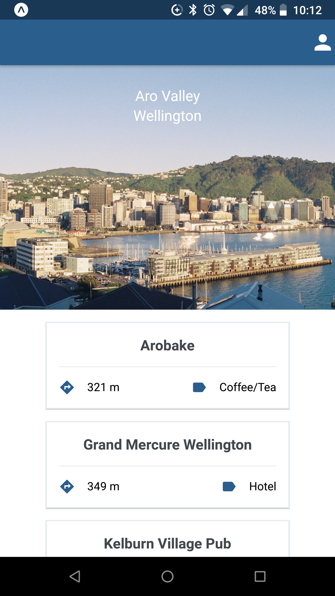
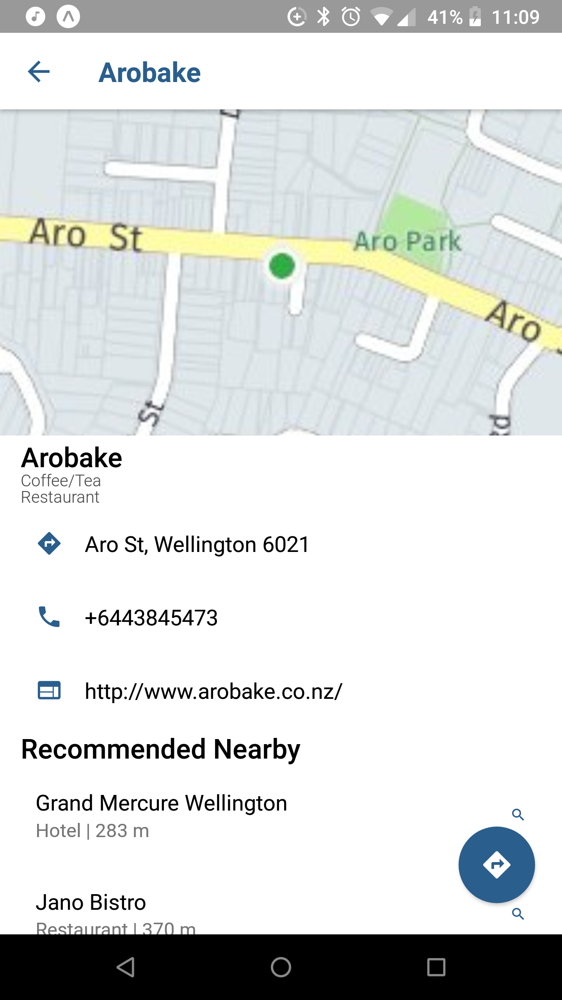
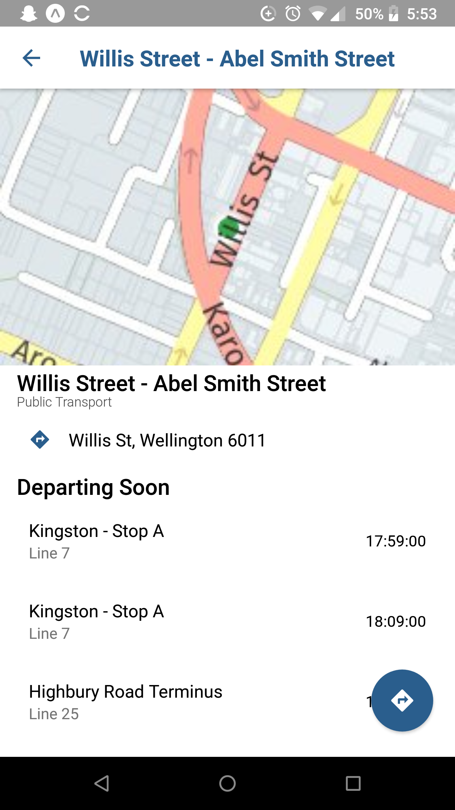

# LocalTip for React Native
This app was created for SWEN 325 at Victoria University of Wellington in New Zealand. 
The project specifications are attached under "Assignment_Specs.pdf". The associated report regarding UI/UX decisions, architecture, and an analysis React Native as a framework are attached under "Assignment2_Report.pdf".
You can view the Ionic v4 version of this app here: [https://github.com/starfishak/localtip](https://github.com/starfishak/localtip)

## Overview ##
The mobile app gives a list of nearby places based on the Here API. Users are able to see place details, such as phone numbers, websites, nearby public transit, and directions. If the place is a public transport station, users are able to see transit departing soon. The homepage updates with an image of the location the user is in from the Unsplash API.

## Clone & Demo ##
To test the LocalTip app, clone this repo.
Install the local node dependencies via npm.

### Expo ###
Expo CLI is used to run this app. You may use the Expo Mobile App to run a development version on your local device.

### APIs ###

You will need two sets of API keys to test the app, from the Here API and the Unsplash API.

#### Here API #### 
[https://developer.here.com/](https://developer.here.com/)

Create an account. Create a project using the HERE Places API.
Copy and paste the API Key and API Code to src/api/here/cred.ts

#### Unsplash API ####
[https://unsplash.com/developers](https://unsplash.com/developers)

Create an account. Create a project; you may use LocalTip as the name and link to this repo for the description.
Copy and paste the Access Key and Secret Key to src/api/unsplash/cred.ts